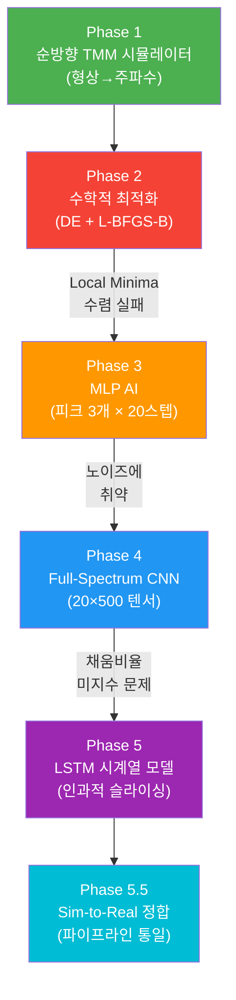

# 🔊 형상 추정 알고리즘 발전 과정 정리

> 프로젝트 폴더 `acoustic_simulation` 전체 소스코드와 문서를 분석한 결과입니다.

---

## 핵심 아이디어

**"일정 유량으로 물을 채우면 시간 = 부피. 공기기둥이 줄어들며 공명주파수가 변한다. 이 소리의 궤적만으로 용기의 3D 내부 형상을 역추정한다."**

---

## Phase 1: 순방향 물리 시뮬레이터 구축

**파일**: [app.py](file:///c:/Users/user/OneDrive%20-%20%EC%B6%A9%EB%B6%81%EA%B3%BC%ED%95%99%EA%B3%A0%EB%93%B1%ED%95%99%EA%B5%90/%EC%9B%90%EB%93%9C%EB%9D%BC%EC%9D%B4%EB%B8%8C%20%EB%8F%99%EA%B8%B0%ED%99%94%20%ED%8F%B4%EB%8D%94/%EC%BD%94%EB%94%A9%20%EC%9E%91%EC%97%85%20%ED%8F%B4%EB%8D%94/acoustic_simulation/app.py), [solver_1d.py](file:///c:/Users/user/OneDrive%20-%20%EC%B6%A9%EB%B6%81%EA%B3%BC%ED%95%99%EA%B3%A0%EB%93%B1%ED%95%99%EA%B5%90/%EC%9B%90%EB%93%9C%EB%9D%BC%EC%9D%B4%EB%B8%8C%20%EB%8F%99%EA%B8%B0%ED%99%94%20%ED%8F%B4%EB%8D%94/%EC%BD%94%EB%94%A9%20%EC%9E%91%EC%97%85%20%ED%8F%B4%EB%8D%94/acoustic_simulation/core/solver_1d.py), [water_filling.py](file:///c:/Users/user/OneDrive%20-%20%EC%B6%A9%EB%B6%81%EA%B3%BC%ED%95%99%EA%B3%A0%EB%93%B1%ED%95%99%EA%B5%90/%EC%9B%90%EB%93%9C%EB%9D%BC%EC%9D%B4%EB%B8%8C%20%EB%8F%99%EA%B8%B0%ED%99%94%20%ED%8F%B4%EB%8D%94/%EC%BD%94%EB%94%A9%20%EC%9E%91%EC%97%85%20%ED%8F%B4%EB%8D%94/acoustic_simulation/core/water_filling.py)

**논리 흐름**:
1. 축대칭 용기 형상을 `r(z)` 함수로 정의 (원통, 원뿔대, 호리병, 사용자정의)
2. **1D 전달행렬법(TMM)** 구현 — 가변 단면적 관을 N개 세그먼트로 분할, 각 세그먼트의 2×2 전달행렬을 곱셈
3. 경계조건: 바닥=강체벽(U=0), 입구=방사 임피던스(unflanged)
4. 물 채움 시뮬레이션: 부피 등분 → 수위 역산 → 각 수위별 공기기둥 TMM 해석
5. **결과**: 형상→주파수 궤적 순방향 계산 성공 (Streamlit UI)

**핵심 성과**: "형상이 주어지면 소리를 정확히 예측"하는 Forward Engine 완성

---

## Phase 2: 수학적 역문제 시도 → 실패

**파일**: [inverse_app.py](file:///c:/Users/user/OneDrive%20-%20%EC%B6%A9%EB%B6%81%EA%B3%BC%ED%95%99%EA%B3%A0%EB%93%B1%ED%95%99%EA%B5%90/%EC%9B%90%EB%93%9C%EB%9D%BC%EC%9D%B4%EB%B8%8C%20%EB%8F%99%EA%B8%B0%ED%99%94%20%ED%8F%B4%EB%8D%94/%EC%BD%94%EB%94%A9%20%EC%9E%91%EC%97%85%20%ED%8F%B4%EB%8D%94/acoustic_simulation/inverse_app.py) (930줄)

**시도한 것**:
1. **물리 기반 초기 추정** (`physics_init`): `1/f₁` vs 시간의 기울기로 단면적 역산 `A(z) = -(4Q/c) / [d(1/f₁)/dt]`
2. **배음비 분류** (`analyze_cavity_type`): f₂/f₁ 비율로 형상 타입 판별 (실린더≈3.0, 호리병>4.5)
3. **Differential Evolution**(전역탐색) + **L-BFGS-B**(정밀최적화) 2단계 최적화
4. 스플라인 제어점 8개 + 높이 H = 총 9차원 파라미터 공간 탐색
5. 적응형 탐색 범위, 매끄러움 정규화, 부피 제약 등 도입

**실패 원인**:
- 수많은 **Local Minima** — 서로 다른 형상이 비슷한 주파수 궤적 생성
- TMM 순방향 계산을 반복 호출 → **극도로 느림** (1회 평가에 수백ms)
- 복잡한 형상(호리병 등)에서 수렴 불가

> [!WARNING]
> 순수 수학적 최적화만으로는 역문제의 비유일성(non-uniqueness)과 계산 비용을 극복할 수 없었음

---

## Phase 3: 1세대 AI (MLP) 도입 → 부분 성공, 구조적 한계

**파일**: [dl_app.py](file:///c:/Users/user/OneDrive%20-%20%EC%B6%A9%EB%B6%81%EA%B3%BC%ED%95%99%EA%B3%A0%EB%93%B1%ED%95%99%EA%B5%90/%EC%9B%90%EB%93%9C%EB%9D%BC%EC%9D%B4%EB%B8%8C%20%EB%8F%99%EA%B8%B0%ED%99%94%20%ED%8F%B4%EB%8D%94/%EC%BD%94%EB%94%A9%20%EC%9E%91%EC%97%85%20%ED%8F%B4%EB%8D%94/acoustic_simulation/dl_app.py), [generate_ml_dataset.py](file:///c:/Users/user/OneDrive%20-%20%EC%B6%A9%EB%B6%81%EA%B3%BC%ED%95%99%EA%B3%A0%EB%93%B1%ED%95%99%EA%B5%90/%EC%9B%90%EB%93%9C%EB%9D%BC%EC%9D%B4%EB%B8%8C%20%EB%8F%99%EA%B8%B0%ED%99%94%20%ED%8F%B4%EB%8D%94/%EC%BD%94%EB%94%A9%20%EC%9E%91%EC%97%85%20%ED%8F%B4%EB%8D%94/acoustic_simulation/generate_ml_dataset.py), [ml_model.py](file:///c:/Users/user/OneDrive%20-%20%EC%B6%A9%EB%B6%81%EA%B3%BC%ED%95%99%EA%B3%A0%EB%93%B1%ED%95%99%EA%B5%90/%EC%9B%90%EB%93%9C%EB%9D%BC%EC%9D%B4%EB%B8%8C%20%EB%8F%99%EA%B8%B0%ED%99%94%20%ED%8F%B4%EB%8D%94/%EC%BD%94%EB%94%A9%20%EC%9E%91%EC%97%85%20%ED%8F%B4%EB%8D%84/acoustic_simulation/core/ml_model.py)

**접근법**:
- 5만 개의 랜덤 형상 시뮬레이션 → CSV 데이터셋 생성
- **입력**: f₁, f₂, f₃ 각 20단계 = **60차원 벡터** (피크 주파수 3개 × 시간 20스텝)
- **출력**: H + r₀~r₇ = **9차원** (높이 + 8개 반지름 제어점)
- **모델**: MLP (256→256→128→9), BatchNorm, Dropout, Sigmoid 출력
- **PhysicalLoss**: 높이(H)에 3배 가중치 부여

**개선점** vs Phase 2:
- 추론 속도 0.01초 이내 (최적화 수분 → AI 즉시)
- 형상 비율(2:2:2:3 — 원통:원뿔:호리병:커스텀) 균형 학습

**발견된 치명적 한계**:
- 입력이 **"피크 3개"** 에만 의존 → 노이즈로 피크 하나만 뭉개져도 AI 완전 붕괴
- NaN을 0으로 채우는 방식 → "피크가 없다"와 "주파수가 0Hz"를 구분 불가

---

## Phase 4: 패러다임 전환 — Full-Spectrum CNN

**파일**: [dl_spectrum_app.py](file:///c:/Users/user/OneDrive%20-%20%EC%B6%A9%EB%B6%81%EA%B3%BC%ED%95%99%EA%B3%A0%EB%93%B1%ED%95%99%EA%B5%90/%EC%9B%90%EB%93%9C%EB%9D%BC%EC%9D%B4%EB%B8%8C%20%EB%8F%99%EA%B8%B0%ED%99%94%20%ED%8F%B4%EB%8D%84/%EC%BD%94%EB%94%A9%20%EC%9E%91%EC%97%85%20%ED%8F%B4%EB%8D%94/acoustic_simulation/dl_spectrum_app.py), [generate_spectrum_dataset.py](file:///c:/Users/user/OneDrive%20-%20%EC%B6%A9%EB%B6%81%EA%B3%BC%ED%95%99%EA%B3%A0%EB%93%B1%ED%95%99%EA%B5%90/%EC%9B%90%EB%93%9C%EB%9D%BC%EC%9D%B4%EB%B8%8C%20%EB%8F%99%EA%B8%B0%ED%99%94%20%ED%8F%B4%EB%8D%94/%EC%BD%94%EB%94%A9%20%EC%9E%91%EC%97%85%20%ED%8F%B4%EB%8D%84/acoustic_simulation/generate_spectrum_dataset.py)

**핵심 전환**: "점 3개 추출" → "스펙트럼 전체를 이미지로 입력"

**입력 구조**:
- **(1, 20, 500)** 텐서 — 1채널 × 20시간스텝 × 500주파수빈(50~5000Hz)
- log₁₀ 파워 스펙트럼을 Min-Max 정규화
- **보조 입력**: 60차원 다중 포먼트 배열 (20스텝 × top-3 피크Hz) → 절대 스케일 보정용

**모델 아키텍처** (`ShapeEstimatorCNN`):
```
Conv2d(1→16, 3×5) → BN → Pool(2×4) → (16,10,125)
Conv2d(16→32, 3×5) → BN → Pool(2×5) → (32,5,25)  
Conv2d(32→64, 3×5) → BN → Pool(1×5) → (64,5,5)
Flatten → 1600차원

보조: Linear(60→128→128→64)

Concat(1600+64=1664) → FC(512→128→9)
```

**데이터셋 혁신**:
- npz 청크 단위 저장 (5000개/파일)
- **Scale Augmentation**: 동일 실루엣에 0.7~1.4배 스케일 랜덤 적용 → "크기가 다르면 주파수가 다르다" 학습 강제
- 파이프라인 통일: TMM 30세그먼트, 500주파수포인트, 50~5000Hz

**성과**: 피크 소실에도 스펙트럼의 "파도치는 큰 틀"을 읽어내어 노이즈 강건성 확보

---

## Phase 5: RNN/LSTM 도입 — 시계열 인과성 모델

**파일**: [dl_spectrum_rnn_app.py](file:///c:/Users/user/OneDrive%20-%20%EC%B6%A9%EB%B6%81%EA%B3%BC%ED%95%99%EA%B3%A0%EB%93%B1%ED%95%99%EA%B5%90/%EC%9B%90%EB%93%9C%EB%9D%BC%EC%9D%B4%EB%B8%8C%20%EB%8F%99%EA%B8%B0%ED%99%94%20%ED%8F%B4%EB%8D%84/%EC%BD%94%EB%94%A9%20%EC%9E%91%EC%97%85%20%ED%8F%B4%EB%8D%84/acoustic_simulation/dl_spectrum_rnn_app.py)

**해결하려는 문제**: 사용자가 물을 60%에서 끊든 95%까지 부었든 앱은 알 수 없음 → CNN은 "항상 90% 채웠다"고 가정해 오차 발생

**모델 아키텍처** (`ShapeEstimatorRNN`):
```
LSTM(input=500, hidden=256, layers=2, dropout=0.2, batch_first=True)
  → 20스텝 순차 처리 → 마지막 타임스텝 출력 (256차원)

보조: Linear(60→128→128→64)

Concat(256+64=320) → FC(128→64→9)
```

**CNN vs RNN 핵심 차이**:

| 항목 | CNN (Phase 4) | RNN (Phase 5) |
|------|--------------|---------------|
| 입력 처리 | 2D 이미지로 한꺼번에 응시 | 1초, 2초... 순차적 기억 |
| 핵심 능력 | 노이즈 속 전체 패턴 인식 | 시간적 인과성(df/dt) 학습 |
| 채움비율 대응 | 고정 가정 필요 | 순차 슬라이싱으로 자연 대응 |
| 메모리 | 공간 필터(커널 공유) | 은닉 상태(Hidden State) |

---

## Phase 5.5: Sim-to-Real 정합 작업

**관련 대화**: `e708bba8` (Aligning Acoustic Simulation Pipeline)

**발견된 현실 세계 불일치**:
- 시뮬레이션 TMM 세그먼트 수, fill fraction 기준(높이 vs 부피), 주파수 해상도가 학습 데이터와 앱 출력 사이에서 불일치
- **방사 효율(Radiation Efficiency)**: 고차 공명 피크가 실제 녹음에서 비례 이상으로 강하게 나타남

**해결**: 
- `app.py` v2로 파이프라인 통일 (TMM 30seg, 500freq, 50Hz~5kHz, 부피 기준 fill fraction)
- 학습 데이터 생성기와 앱 출력의 완전 동일 조건 확보

---

## 논리적 발전 흐름 요약



---

## 각 Phase에서 극복한 핵심 장벽

| Phase | 장벽 | 해결 전략 |
|-------|------|----------|
| 1→2 | 순방향은 되는데 역방향이 안 됨 | 최적화 알고리즘 도입 |
| 2→3 | Local Minima + 느린 속도 | 5만개 데이터로 AI 학습 |
| 3→4 | 피크 추출 의존성 (노이즈 취약) | 전체 스펙트럼을 이미지로 입력 |
| 4→5 | 채움 비율을 모르면 전체가 틀림 | 시계열 순차 처리(LSTM) |
| 5→5.5 | 학습/추론 파이프라인 불일치 | TMM 파라미터 완전 통일 |

---

## 현재 파일 구조 요약

| 파일 | 역할 | Phase |
|------|------|-------|
| `core/solver_1d.py` | TMM 물리 엔진 | 1 |
| `core/geometry.py` | 형상 정의 (원통/원뿔/호리병) | 1 |
| `core/water_filling.py` | 물 채움 시뮬레이션 | 1 |
| `app.py` | Streamlit 순방향 시뮬레이터 UI | 1 |
| `inverse_app.py` | DE+LBFGS 역추정 | 2 |
| `generate_ml_dataset.py` | MLP용 피크 데이터셋 생성 | 3 |
| `core/ml_model.py` | MLP 모델 + 스케일러 | 3 |
| `dl_app.py` | MLP 학습/추론 UI | 3 |
| `generate_spectrum_dataset.py` | CNN/RNN용 스펙트럼 npz 생성 | 4 |
| `dl_spectrum_app.py` | CNN 학습/추론 UI | 4 |
| `dl_spectrum_rnn_app.py` | LSTM 학습/추론 UI | 5 |
