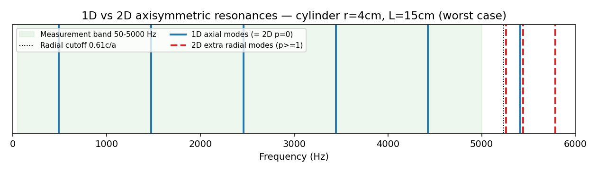

# 유효대역 검증 — 1D 평면파 TMM vs 2D 축대칭 (근거 노트)

> 최종 보고서용 근거. 재현: `python docs/analysis/1d_vs_2d_validband.py`
> 그림: `docs/analysis/1d_vs_2d_validband.png`

## 질문
측정 대역 **50~5000 Hz** 에서 1D 평면파 TMM이 우리 컵 크기(반지름 ≤4cm)에 대해 유효한가?
2D 축대칭으로 올리면 대역 안에서 결과가 달라지는가?

## 방법 (해석적 모드 비교)
폐-개 원형 실린더(공기기둥)의 고유모드를 해석적으로 계산해 비교. 실린더는 반경 차단주파수가 가장 낮은(=넓을수록 낮음) **최악 케이스**라 상한 검증에 적합.

- 축 방향(closed–open): `k_z = (2q-1)·π / (2·L_eff)`, `L_eff = L + 0.6133·a`
- 반지름 방향(rigid wall, m=0): `k_r = α_p / a`, `α_p` = `J0'`의 p번째 근
  - `p=0 → k_r=0` = 평면파(=1D) 계열
  - `p≥1` = 2D가 추가하는 **반경 모드**
- `f = c·√(k_z² + k_r²) / (2π)`, `c = 343.4 m/s` (20°C, `core/materials.py`와 동일)
- **on-axis 마이크는 각 모드(m≥1)를 못 봄**(축상 마디) → m=0 모드만 고려.

## 결과

| 반지름 | 높이 | 반경 차단 `0.61c/a` | 첫 반경 모드 `f(1,1)` | 대역 내 1D 모드 | **대역 내 추가 2D 모드** |
|---:|---:|---:|---:|---:|---:|
| 1 cm | 5 / 15 cm | 20,949 Hz | 대역 밖 | 2 / 5 | **0** |
| 2 cm | 5 / 15 cm | 10,474 Hz | 대역 밖 | 2 / 5 | **0** |
| 4 cm | 5 cm | 5,237 Hz | 5,361 Hz | 2 | **0** |
| 4 cm | 15 cm | 5,237 Hz | 5,259 Hz | 5 | **0** |

**최악 케이스 상세 (r=4cm, L=15cm):**
- 1D 축 모드 (대역 내): **492, 1476, 2460, 3443, 4427 Hz** — 2D의 `p=0` 모드와 **완전 동일**.
- 2D 첫 반경 모드: **5,259 Hz** — 측정 대역(5000 Hz) **바로 위**.

## 결론
- **50~5000 Hz 대역 안에는 2D가 추가하는 반경 모드가 하나도 없다** (r ≤ 4cm 전 범위).
- 따라서 **대역 내 공명 주파수는 1D = 2D (동일).** → **1D TMM 유지**가 타당(더 단순·빠르고 미분가능, PINN에 유리).
- 이전에 언급된 "2500 Hz 한계"는 각 모드 `(1,0)` 차단(`0.293c/a`) 기준이었으나, **on-axis 셋업에선 이 모드가 축상 마디라 가진·감지되지 않음** → 실질 한계는 첫 반경 모드 `≈ 0.61c/a ≈ 5,259 Hz`(넓은 컵)로, 대역이 그 아래에 있음.

## 한계 / 재검토 조건
- 본 비교는 **공명 주파수** 기준. 아래 2차 효과는 차단 아래라 작으며, 필요 시 멀티모달법으로 정밀화 가능:
  1. 링 **단차(step) 접합부**의 소멸(evanescent) 모드 보정 — 1D는 면적 연속으로 근사(주도항 정확).
  2. 입구 **방사**(마이크 B 모델의 외부장)는 내부 1D/2D 유효성과 무관한 별개 관측 모델.
- **재검토 트리거**: 측정 대역을 5 kHz 초과로 확장하거나, **비원형(사각 등) 단면** 실제 배관을 다룰 때 (후자는 각 모드 = 완전 3D 필요, on-axis에선 약함).
