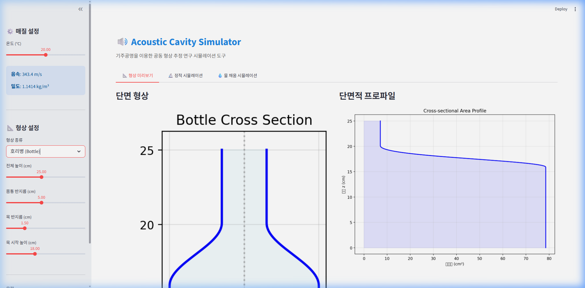
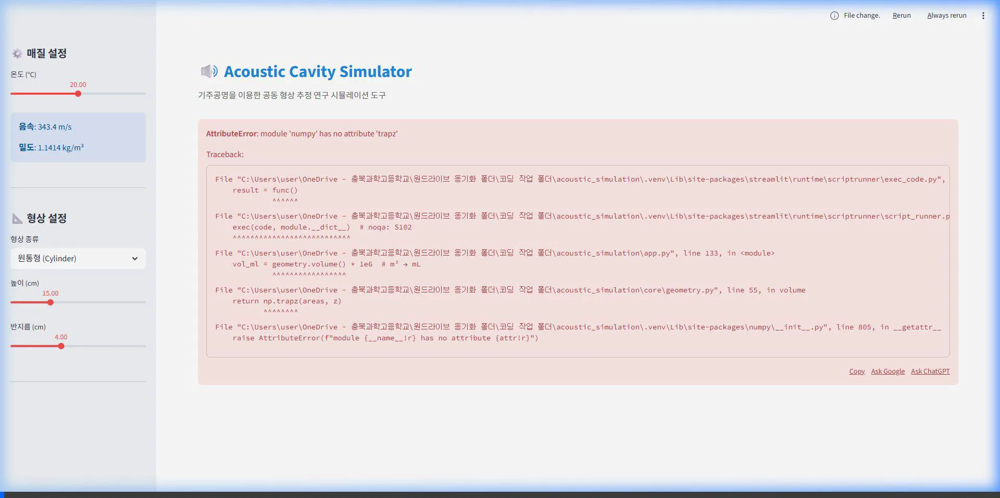
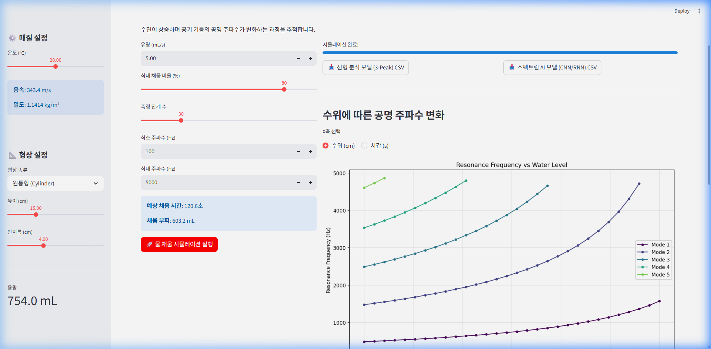
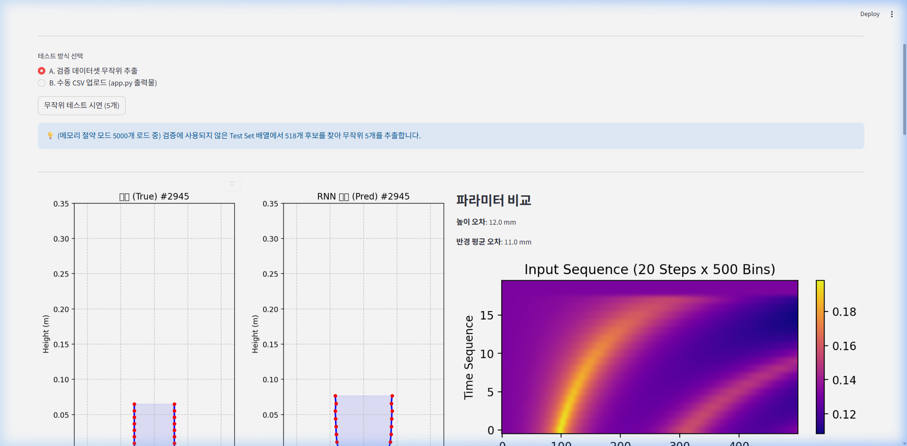

# 🎵 음향 기주공명 기반 용기 형상 역추적 프로젝트 요약

본 문서는 현재 폴더(`acoustic_simulation`) 내의 코드 파일들과 `project_roadmap.md.resolved` 등의 분석을 바탕으로, 이 프로젝트가 **어떤 의도**에서 출발하여 **어떤 발전 과정**을 거쳐 현재에 이르렀는지 정리한 종합 요약 문서입니다.

---

## 1. 프로젝트의 최초 의도 및 목표 (Overview & Intent)
이 프로젝트의 핵심 액심 목표는 **"수돗물(일정 유량)이 용기에 채워질 때 들리는 소리(공명 주파수 변화)를 듣고, 눈에 보이지 않는 용기의 내부 3D 형상(Geometric Profile)을 실시간으로 역산(추정)해 내는 것"**입니다. 
빛이 닿지 않는 불투명한 용기라도, 시간에 따른 '소리의 궤적'만으로 공간 지도를 그려내는 비침습적(Non-invasive) 스마트 측정 솔루션 개발이 최종 목표입니다. 

이를 위해 흐른 시간이 곧 채워진 물의 부피와 비례한다는 '시간-부피 매핑(Volume-Time Mapping)' 원리와 기주공명(Air Column Resonance) 음향학을 결합했습니다.

---

## 2. 발전 과정 (Evolutionary Phases)
프로젝트는 단순한 물리 시뮬레이션에서 출발하여 실패를 극복하며 고도의 딥러닝 아키텍처로 진화해 왔습니다.

### 🚧 Phase 1: 순방향 수학적 시뮬레이터 완성 (`app.py`)
- **성과:** 1차원 전달행렬법(1D TMM)과 헬름홀츠 공명 이론 등을 파이썬으로 완벽히 구현했습니다.
- **기능:** 원통, 원뿔대, 호리병 등 임의의 형상과 유량을 입력하면 시간에 따라 변화하는 기본 및 고차 공명 주파수($f_1, f_2, f_3$)를 순방향으로 정확하게 시뮬레이션하고 Streamlit으로 시각화하는 데 성공했습니다.
 

### ⚠️ Phase 2: 역문제(Inverse Problem)의 난관 (`inverse_app.py`, `dl_app.py`)
- **수학적 최적화의 실패:** 무작위 형상에서 출발하여 시뮬레이터 주파수 결과에 끼워 맞추는 수학적 최적화(Differential Evolution 등)는 수많은 지역 최적해(Local Minima)에 빠져 수렴하지 못했습니다.
- **1세대 AI 도입의 맹점:** 3개의 피크 주파수를 추출하여 다층 퍼셉트론(MLP)에 학습시켰으나, 현실 노이즈로 인해 피크가 하나라도 뭉개지면 AI가 완전히 망가지는 치명적 한계(Fragility)를 발견했습니다.

### 🔄 Phase 3: 투 트랙(Two-Track) 개편 및 패러다임 전환 (`dl_spectrum_app.py`)
- 직렬 통합 방식을 버리고 '물리 우선 규칙 기반'과 '실전형 딥러닝' 두 갈래로 나눴습니다.
- **텐서 레벨 스펙트럼 도입:** 점 3개의 피크를 추출하는 대신, 잡음이 포함되더라도 파동의 생김새 자체를 이미지로 파악하는 **1D-CNN (Full-Spectrum Tensor)** 방식을 도입했습니다. 20초간의 스펙트럼 변동 텐서(10,000차원)를 통째로 입력하여 배경 노이즈(백색 잡음)를 극복했습니다.
 
 

### 🧠 Phase 4: Sim-to-Real 극복과 하이브리드 RNN-CNN 모델 탄생 (`dl_spectrum_rnn_app.py`)
- **현실 세계의 치명적 변수 발견:** 사용자가 컵에 물을 "얼마나(몇 %) 채우다 멈췄는지" AI는 절대 알 수 없다는 근본적 모순이 발견되었습니다. 무조건 90% 채웠다고 착각하면 전체 병렬 오차가 발생했습니다.
- **혁신적 해결책 (인과성 기반 슬라이싱):**
  - **RNN/LSTM 역방향 층:** 물이 차오르는 매초의 주파수 변화량($\Delta S(f)$)을 인과적으로 기억하도록 하여, 현재 수위까지 파악 가능한 단면을 블록 쌓듯이 차곡차곡 스케치(Slice-by-Slice)합니다. 물을 어디서 끊더라도 계산이 망가지지 않게 되었습니다.
  - 이 모델의 도입으로 순수 시계열(Time-Sequence) 정보를 활용한 역추적이 모델 아키텍처 레벨에서 정립되었습니다.
 

---

## 3. 현재 진행 상태 및 파일 구성 (Current Status)
현재 프로젝트는 **파이토치(PyTorch)**와 **스트림릿(Streamlit)**을 기반으로 데이터 생성, 모델 훈련, 검증까지 한 번에 가능한 통합 MLOps 환경으로 진화한 상태입니다.

- **`app.py`**: 프로젝트의 코어인 물리 엔진 기반 음향/물채움 시뮬레이터.
- **`dataset_generator.py` 계열**: 딥러닝 학습을 위한 대규모 합성 데이터(Synthetic Data) 생성기.
- **`dl_spectrum_rnn_app.py` 등**: 시계열 스펙트럼 데이터를 입력받아 LSTM 기반으로 3D 형상 파라미터(H, $r_0 \sim r_7$)를 출력해 내는 AI 학습 및 추론 UI.
- 향후 스마트폰 마이크 센서 등을 이용해 **완전한 현실 세계(Real-World) 비침습 측정기**로 상용화/실증하는 단계가 남은 최종 과제로 보입니다.
